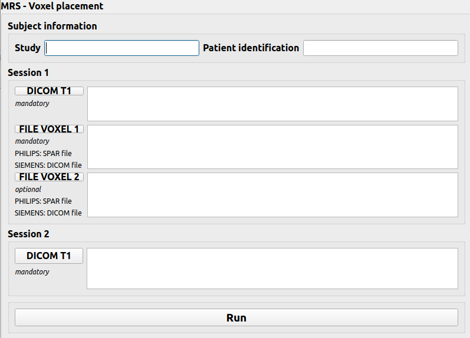

# mrs-voxel-placement

Obtain voxel placement prescription for a new MRS session based on a previous MRS session.

Both the initial and the new (second) session must include T1-weighted anatomical data.

Table of contents

1. [Disclaimer](#disclaimer)
2. [How to use](#how-to-use)
3. [How to install](#how-to-install)

<a name="disclaimer"></a>
## Disclaimer
This little application has been developed for a specific use and is not intended to be modular.
For now it is only work for Philips MRS data (using .SPAR file for MRS data).
Use for Siemens data (using DICOM file for MRS data) is under development

This work have been inspired by the following work:

Woodcock, Eric A. “Automated Voxel Placement:
A Linux-Based Suite of Tools for Accurate and Reliable Single Voxel Coregistration.”
Journal of Neuroimaging in Psychiatry & Neurology 3, no. 1 (2018): 1–8.
https://doi.org/10.17756/jnpn.2018-020.

See code here: https://github.com/ewoodcock/avp_scripts/tree/master


<a name="how-to-use"></a>
## How to use

If it is the firt time you use this module, you need to configure your `config/config.json` as explain in the ["How to install"](#how-to-install) part.

You only need to give DICOM directories path and the module will organize your data in BIDS (using [dcm2bids](https://unfmontreal.github.io/Dcm2Bids)) in your output directory. A [dcm2bids configuration file](https://unfmontreal.github.io/Dcm2Bids/3.1.1/how-to/create-config-file/) should be specified in the `BidsConfigFile` field in the [configuration file](./config/config.json) in order to recognize automatically T1w image.


### Launch the module without arguments

```bash
python /mrs-voxel-placement/mrs-voxel-placement/main.py
```
The following window will appear:



- Fill "Study" and "Patient identification"

- In the "session 1" part, click on "DICOM T1" and choose your DICOM directory for the first session (that contains T1w image)

- In the "session 1" part, click on "FILE VOXEL 1" and choose the MRS data (.spar file for Philips) of the first session

- If you have a second MRS acquistion with a different voxel placement for your first session : in the "session 1" part, click on "FILE VOXEL 2" and choose the MRS data corresponding to this acquistion

- In the "session 2" part, click on "DICOM T1"and choose your DICOM directory for the second session (that contains T1w image)

- Click on "run.

The size, off center and angulation to used for the placement of the voxel for the second session will be display on the terminal.

You can also find all the information in the file `/OutputDirectory/derivatives/sub-*/ses-*/mrs-voxel-placement`.


### Launch the module with arguments

```bash
python /mrs-voxel-placement/mrs-voxel-placement/main.py --session1 path/to/dicom/sess1 --session2 path/to/dicom/sess2 --spectro_files path/to/spectro/file/1 path/to/spectro/file/2 --study studyname --patient patientname
```

The size, off center and angulation to used for the placement of the voxel for the second session will be display on the terminal.

You can also find all the information in the file `/OutputDirectory/derivatives/sub-*/ses-*/mrs-voxel-placement`.


<a name="how-to-install"></a>
## How to install
### Clone this repository

```bash
git clone https://github.com/IRMaGe-3T/mrs-voxel-placement.git
```

### Install requirements

The following python librairies are required:

- argparse
- dcm2bids>=3.1.1
- pyQt5
- nibabel
- numpy
- scipy

The following sofware are required:

- [dcm2niix](https://github.com/rordenlab/dcm2niix/releases)
- [FSL](https://fsl.fmrib.ox.ac.uk/fsl/docs/#/)


### Configure your `config/config.json`

Add the following path in the configuration file:
- OutputDirectory = path to BIDS directory, the processing will be added in OutputDirectory/derivatives/sub-*/ses-*/
- BidsConfigFile = path to dcm2bids config file (you can use the one in the config file folder) (see [dcm2bids configuration file](https://unfmontreal.github.io/Dcm2Bids/3.1.1/how-to/create-config-file/))


```bash
{
    "OutputDirectory": "/path/to/bids/directory",
    "BidsConfigFile": "/path/to/bidsd_dcm2bids_config_template.json"
}
```
